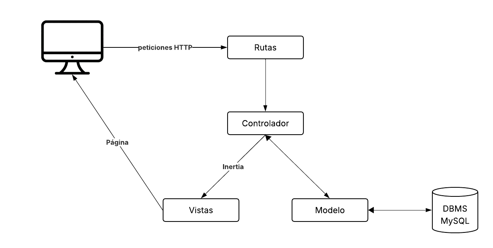
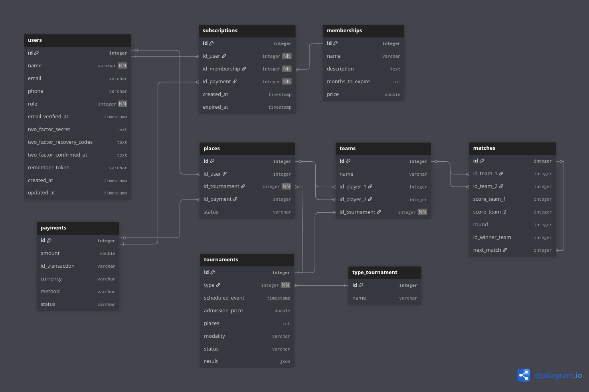
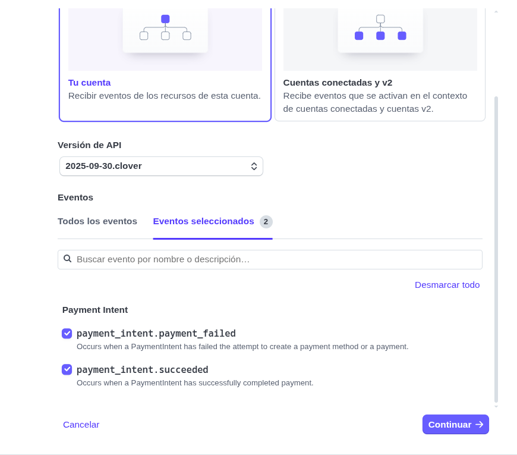
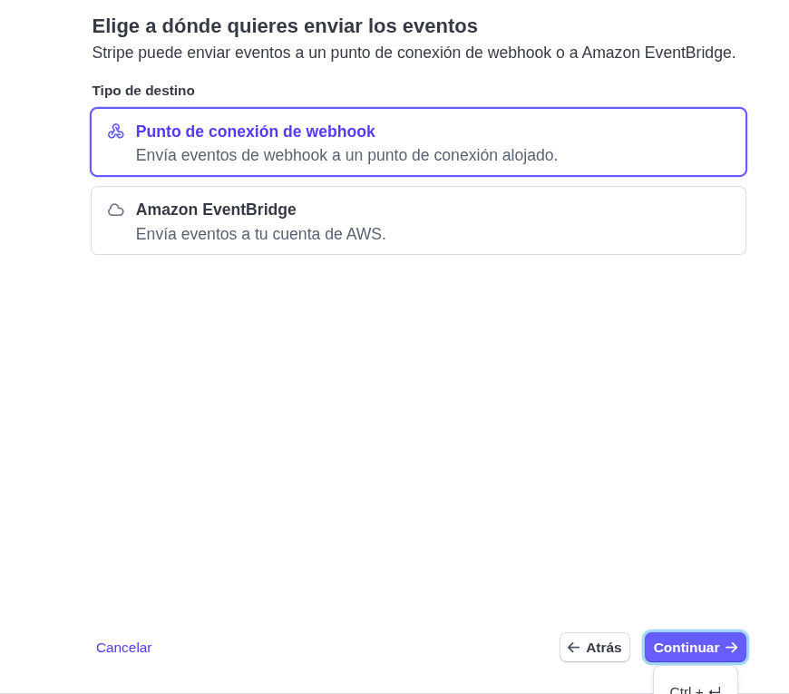
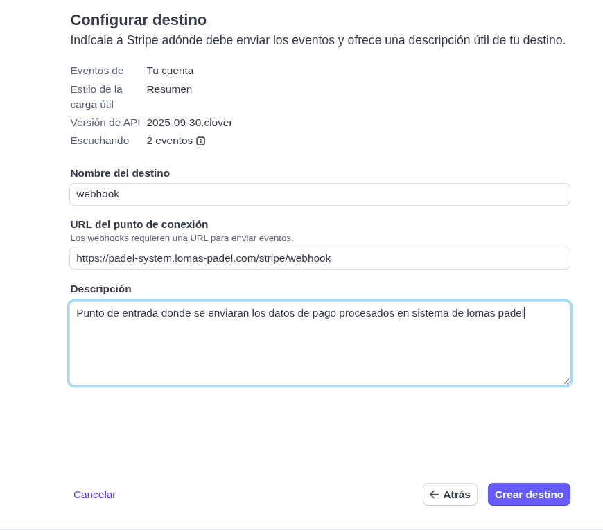
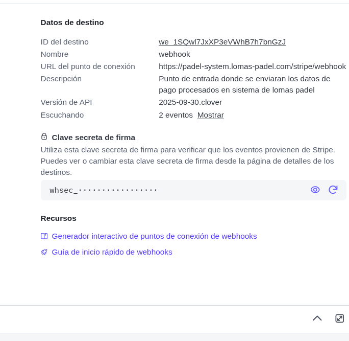
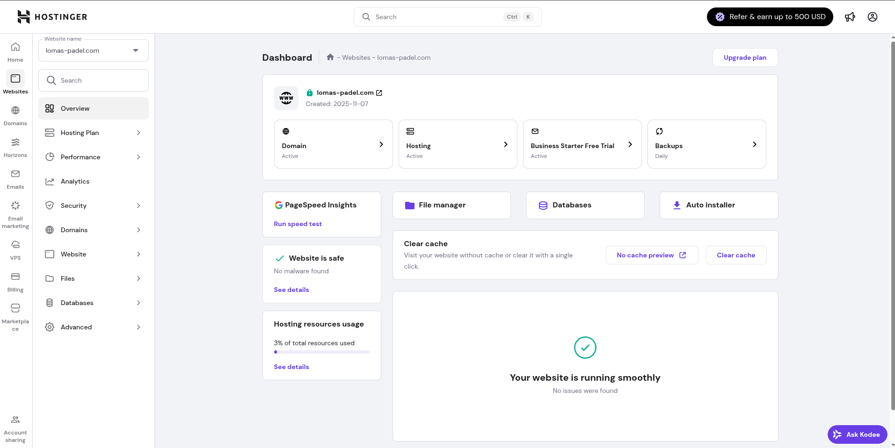
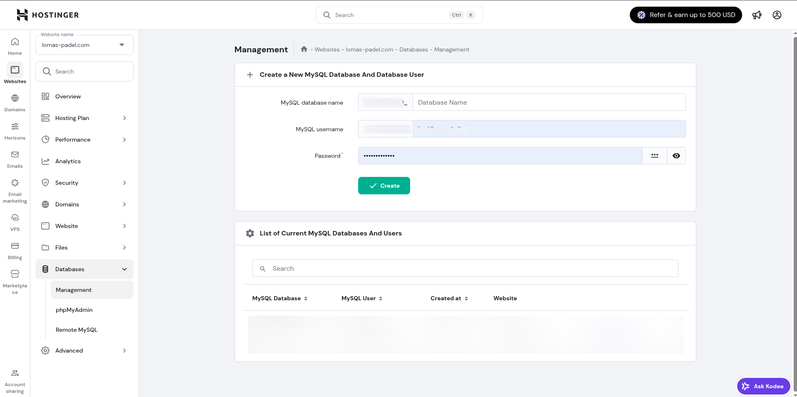
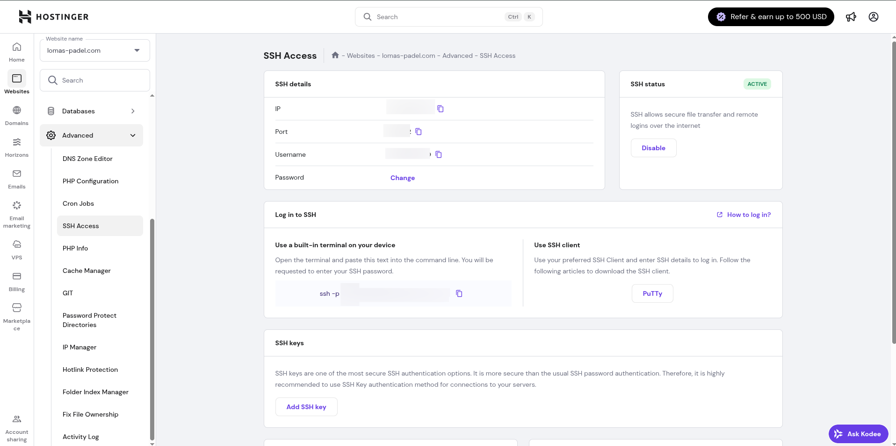
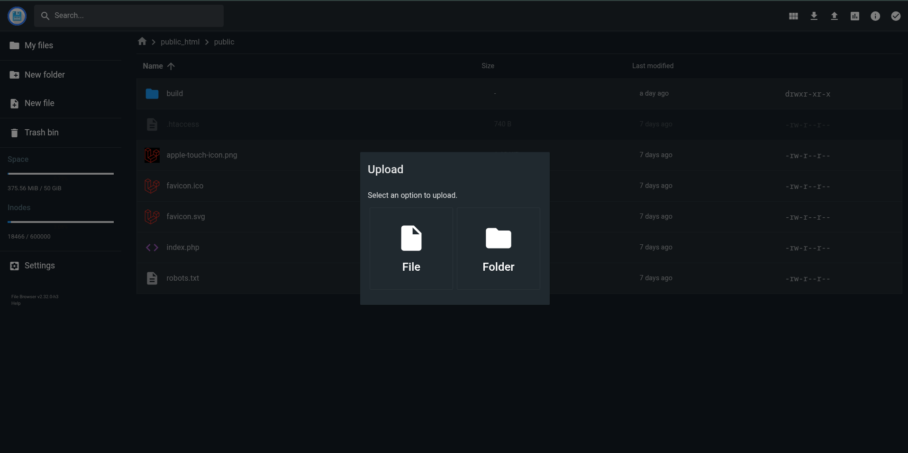

# Lomas padel

Aplicación web para la gestión de torneos de pádel. Incluye registro de torneos, calendario de partidos, visualización de la primera etapa de los brackets y gestión manual de resultados. Los jugadores podrán seleccionar en qué torneo participar y realizar pagos de inscripción.


## Tecnologias usadas en el proyecto

Describiremos las tecnologías usadas en el proyecto, la arquitectura con la que se construyo, frameworks y versiones con el que se desarrollo el proyecto



### Arquitectura general
* **Tipo de aplicación:** Monilito(Frontend + backend integrados)
* **Estructura:** Modelo-Vista-Controlador
* **Framework base:** Laravel 12+
* **Puente de comunicación entre backend y frontend:** Inertia.js
* **Sistema de autenticación:** Laravel

### Backend
* **Lenguaje:** PHP 8.4+
* **Manejador de base de datos(SGBD):** MySQL 8.4+

### frontend
* **Framework:** Vue 3
* **Puente de comunicación entre backend y frontend:** Inertia.js
* **Compilador:** Vite
* **Estilos:** Tailwind 4

### Integraciones externas
* **Pasarela de pagos:** Stripe Elements

### Estructura de carpetas

Al tener un proyecto de tipo monolito, tenemos tanto el backend del proyecto como las vistas en un mismo proyecto, en la siguiente estructura del proyecto, tenemos las carpetas mas relevantes que componen entre controladores, vistas, clases y migraciones de base de datos


~~~bash
/root
│
├── app/
│   ├── Http/
│   │   ├── Controllers/
│   │   ├── Middleware/
│   │   └── Requests/
│   ├── Mail/
│   ├── Models/
│   ├── PDF/
│   └── Providers/
│   
├── bootstrap/
├── config/
├── database/
│   ├── factories/
│   ├── migrations/
│   └── seeders/
│
├── public/
│   ├── build/
│   └── index.php
│
├── resources/
│   ├── css/
│   └── js/
│       ├── assets/
│       ├── componets/
│       └── pages/
│           ├──admin/
│           ├──auth/
│           ├──memberships/
│           ├──places/
│           ├──public/
│           ├──setting/
│           ├──tournaments/
│           └──typeTournaments/
├── routes/
│   ├── admin.php
│   ├── auth.php
│   ├── player.php
│   ├── setting.php
│   └── web.php
├── .env
├── .gitignore
└── composer.json
~~~

Dentro de la carpeta `app`, esta compuesto principalmente por la parte del backend, dentro de `http/controllers` tenemos todos los controladores, normalmente uno por modelo

|Controlador|Uso|
|-----------|------------------------------------------|
|AdminController|Administra los usuarios administradores|
|PlayerController|Renderiza la pantalla principal del dashboard del usuario cliente|
|CheckoutController|Genera la intencion de pago para los lugares o membresias|
|DashboardController|Renderiza la pantalla principal del dashboard del admin|
|MembershipController|Administra las membresías por parte del administrador|
|TypeTournamentController|Administra los tipo de torneos por parte del administrador|
|TournamentController|Administra los torneos por parte del administrador|
|PlacesController|Muestra los lugares por torneo al administrador y reagenda los lugares a otros torneos|
|PublicController|Renderiza todas las páginas publicas, como la pagina raiz, el calendario de eventos, el bracket del torneo, etc|
|StripeWebhookController|Registra el pago realizado por los clientes, aqui esta el endpoint donde Stripe entrega el resultado del proceso de pago|

Las rutas estan definidas dentro de la carpeta `routes`, donde

|Archivo|Uso|
|-------|---|
|admin|Definicion de las rutas del administrador|
|player|Definicion de las rutas para los usuarios jugadores|
|web|Definicion de las rutas publicas como la página home, etc.|
|settings|Definicion de las rutas de configuración, generadados por `Laravel Fortify`|
|auth|Definicion de las rutas de autenticación, generadados por `Laravel Fortify`|

## Arquitectura de datos

En este apartado describiremos las tablas de la base de datos de la aplicación y las funcionalidades de las columnas

### Diagrama entidad-relación



para la versión actual del sistema, el registro de los participantes del equipo se hace de forma individual y no por equipos, esto esta como nota que en la segunda interacción con el desarrollo del sistema esto cambiara

### Entidades de la BD

|Entidad |Uso |
|------------------|---|
|Users             |Entidad de los usuarios del sistema|
|Subscriptions     |Entidad de las subscripciones a las membresias que tienen los usuarios y las membresias es una relacion n:m con atributos en la relación|
|Memberships      |Membresias ofrecidas por Lomas padel, entidad que cambia el tiempo de duración de la membresía, precio y descripción de los beneficios| 
|Places|Entidad donde registramos el lugar del jugador, el torneo al que pertenece, si esta libre el lugar o no y ID el pago del lugar |
|Payments|Entidad que registra los pagos tanto de las membresías como de los lugares del torneo|
|Torurnaments |Entidad que tiene los datos basicos del torneo, tanto los lugares disponibles, modalidad, fecha de evento, precio de admisión, los resultados y status del torneo|


A partir de aqui, se describiran entidades no usadas en el proyecto pero que estan planeadas para extender funcionalidades del sistema, como actualización del partido, marcadores, etc

|Entidad |Uso |
|---|---|
|Teams|Entidad donde se relacionaran los jugadores con el equipo|
|Matches|Entidad que registrara los partidos, resultados, la ronda jugada y su siguiente partido, esto permitira construir un bracket con información de los partidos, es una tabla autorreferencial


### Construcción de la base de datos

Para la construcción de la base de datos, usamos el sistema de migraciones de laravel, para poder construir la base de datos en un entorno local o de producción debemos seguir los siguientes pasos:

1. Crear una base de datos en el manejador de base de datos a usar, para este caso se usa MySQL
2. Configurar las variables de entorno con las credenciales para acceder a la base de datos, las variables a configurar son

```bash
DB_CONNECTION=mysql #puede ser MySQL, PostgreSQL, SQLite o SQL Server.
DB_HOST=127.0.0.1
DB_PORT=3306
DB_DATABASE=PADEL_DB #Nombre de la base de datos con el que se creo
DB_USERNAME=root #Usuario para conectarse a la base de dats
DB_PASSWORD=fdasfasd934!+ #Contraseña para acceder a la base de datos
```

3. Ejecutar las migraciones desde la raiz del proyecto en la terminal, usando el siguiente comando

```bash
php artisan migrate
```

Con estos pasos se construira la base de datos en el servidor que configuremos.

## Configuración de entrega de correos

Se requieren los siguientes datos para hacer las notificaciones del correo

* Host
* Puerto
* Usuario
* Contraseña

El esquema que usamos para la entrega de datos es SMTP, datos que tambien debemos especificar en las variables de entorno

Los puertos comunmente son 25, 587 o 465, esto depende de lo que indique el provedor del servidor de pruebas o de producción

Las variables de entorno que se deben configurar son las siguientes:

```bash
MAIL_MAILER=smtp # usaremos el esquema SMTP
MAIL_SCHEME=smtp
MAIL_HOST= # Host SMTP que indique el provedor
MAIL_PORT= # Puerto indicado por el provedor
MAIL_USERNAME= # Usuario para acceder al servicio de email, normalmente el correo que se usa para iniciar sesión de forma normal
MAIL_PASSWORD= #Contraseña para acceder al servicio de email, normalmente el correo que se usa para iniciar sesión de forma normal
MAIL_FROM_ADDRESS="" # Correo desde donde se quiere enviar las notificaciones
MAIL_FROM_NAME="${APP_NAME}" # Nombre con el que llega el correo, por defecto es el nombre de la aplicación
```


## Configuración de pasarela de pago

Usamos la pasarela Stripe y su libreria Stripe elements para tener integrado en la misma página la pasarela de págo, para que funcione correctamente debemos configurar correctamente las variables de entorno con los valores que nos proporcione stripe en su dashboard, las variables que se deben configurar en el archivo .env son:

```bash
STRIPE_KEY= #valor que se muestra al inicio del dashboard como "Clave publicable"
STRIPE_SECRET= #valor que se muestra al inicio del dashboard como "Clave secreta"
STRIPE_WEBHOOK_SECRET= #valor que se muestra al terminar de configurar el webhook
```

### Configuración de webhook en local

Para poder hacer pruebas de pago en un entorno local, debemos tener instalado el CLI de Stripe, para instalar el CLI siga la documentación de Stripe [Documentación de instalación de CLI Stripe](https://docs.stripe.com/stripe-cli/install)

Ya que tenga instalado el CLI de Stripe, inicie sesión en la terminal y despues, ejecute el siguiente comando para obtener la firma secreta stripe


```bash
stripe listen --forward-to localhost:8000/stripe/webhook
```

### Configuración de webhook en linea

Para hacer pagos en un servidor, se debe de contar con una URL con certificado SSL, ya que de otra forma stripe no escuchara ordenes de pago que no tengan un protocolo HTTP seguro. Para que stripe sepa donde enviar los datos del procesamiento de pago, debe seguir los siguientes pasos:

1. Crear un nuevo Webhook desde el dashboard de stripe y seleccionar los eventos `payment_intent.payment_failed` y `payment_intent.payment_succeeded` 



2. Seleccionar punto de conexión webhook para el envio de datos




3. Dar nombre y especificar la url donde se entregaran los datos, tambien se puede colocar una descripción



4. Al terminar nos llevara al panel de eventos del webhook y tendremos la firma secreta del webhook




Dependiendo del ambiente que se este trabajando, debe usar el primer o segundo metodo para obtener la ultima variable de entorno para que se puedan procesar los pagos con Stripe

<span style="color:red">ADVERTENCIA:</span>**Para actualizar las variables de entorno de stripe, debemos de recompilar las vistas ya que no se llama la variable de entrono en tiempo de ejecución, consulta la sección `Preparación de proyecto para deploy en Hostinger` en el apartado `Compilación de las vistas`**

## Preparación de proyecto para deploy en Hostinger

Una vez que se tenga el proyecto completo, vamos a seguir los siguientes pasos para tener el proyecto listo para subir al servidor de hostinger

1. limpiar la cache de la configuración del proyecto con el comando `php artisan config:clear`

2. Borrar la cache de los archivos bootstrap con el comando `php artisan optimize:clear`

3. Compilar los assets y las vistas del proyecto con el comando `npm run build`

Con esto tenemos el proyecto preparado para subirlo al repositorio de github con el que podremos clonarlo en el servidor

## Despliege de proyecto en Hostinger

Para desplegar el proyecto en hostinger, debemos de primero crear una base de datos, entramos al hpanel de Hostinger, entramos a nuestro sitio y seleccionamos `databases`



Damos un nuevo nombre a la base de datos, un nuevo usuario y una contraseña, estos datos los guardamos para mas adelante configurar las variables de entorno de la base de datos



Habilitamos el acceso SSH para acceder a la terminal de forma remota en el apartado `Advanced > SSH Access`



En el panel SSH Access cambiamos la contraseña y copiamos el comando que nos da en Log in to SSH en nuestra terminal y nos autenticamos con la contraseña que cambiamos

Estando adentro de la terminal de forma remota, nos dirigimos a la carpeta public_html 

~~~bash
cd domains/<tu dominio>/public-html
~~~

Clonamos el repositorio de github
~~~bash
git clone <url del repositorio> .
~~~

Instalamos las dependencias de php
~~~bash
composer install
~~~

Creamos el archivo .env copiando el .env.example que esta en el repositorio
~~~bash
cp .env.example .env
~~~

Configuramos las variables de entoro como se indico en los puntos anteriores mas estas variables para que el proyecto este en modo de producción y no muestre detalles en los errores

```bash
APP_NAME="Lomas padel" #Nombre de la aplicación
APP_ENV=production #hace que los errores en servidor no sean visibles para el usuario
APP_DEBUG=false #desactiva el debuger de laravel
```

Cuando terminamos de configurar las variables de entorno generamos una llave al archivo .env, esta parte es importante ya que la clave generada permite cifrar datos sensibles como cookies y constraseñas

~~~bash
php artisan key:generate 
~~~

En la carpeta raiz del proyecto, creamos un archivo `.htaccess` y colocamos este modulo de contenido

~~~html
<IfModule mod_rewrite.c>
	RewriteEngine On
	RewriteRule ^(.*)$ public/$1 [L]
</IfModule>
~~~

Generamos las migraciones que construiran la base de datos, registraran los roles y creara el primer usuario administrador en la base de datos

~~~bash
php artisan migrate --seed
~~~

Para modificar el correo y contraseña del primer usuario, entramos al archivo `/database/seeders/DatabaseSeeder.php` y modificamos los atributos con los valores deseados

~~~php
$admin = User::factory()->create([
    'name' => <tu nombre>,
    'email' => <tu correo>,
    'password'=> <tu contraseña>,
    'phone' => <tu teléfono>
]);
~~~

Al no tener disponible `npm` en la terminal de hostinger y no poder instalarla, tendremos que compilar las vistas de forma local, en la preparacion del proyecto, usamos el comando `npm run build`, esto genera una carpeta dentro de `public` llamado `build`, esta carpeta tiene todos los assets para la vistas del proyecto

~~~bash
/
└── public/
   └── build/ #carpeta generada
~~~

Esta carpeta la subiremos manualmente, dentro de la carpeta `public` que esta Hostinger, para esto entramos a `File manager`


Nos dirigimos a la carpeta `public` y seleccionamos el icono de upload y seleccionamos `folder`



Con esto la aplicación esta publicada en hostinger

## Ejecución de la aplicación

Daremos los pasos para hacer la ejecución del proyecto en un entorno local y de producción

### Entorno de pruebas

Para ejecutar la aplicación en un ambiente local solod debe escribir en la raiz del proyecto el siguiente comando

```bash
composer run dev
```

